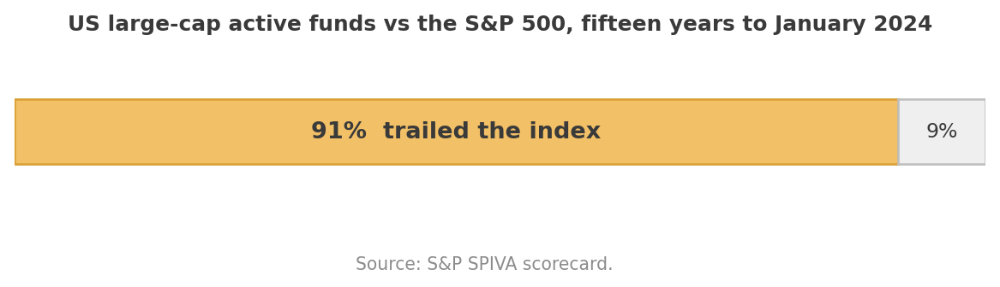
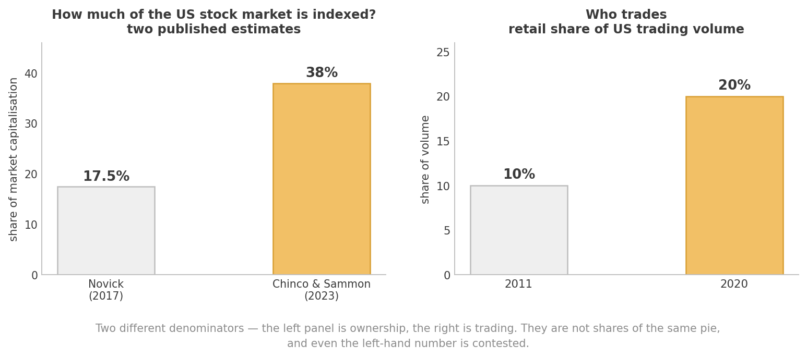
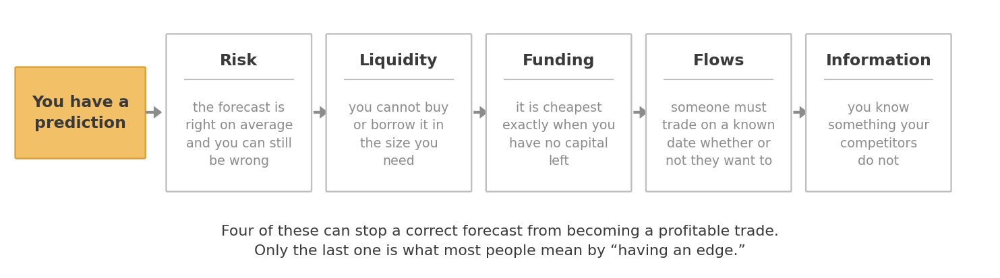
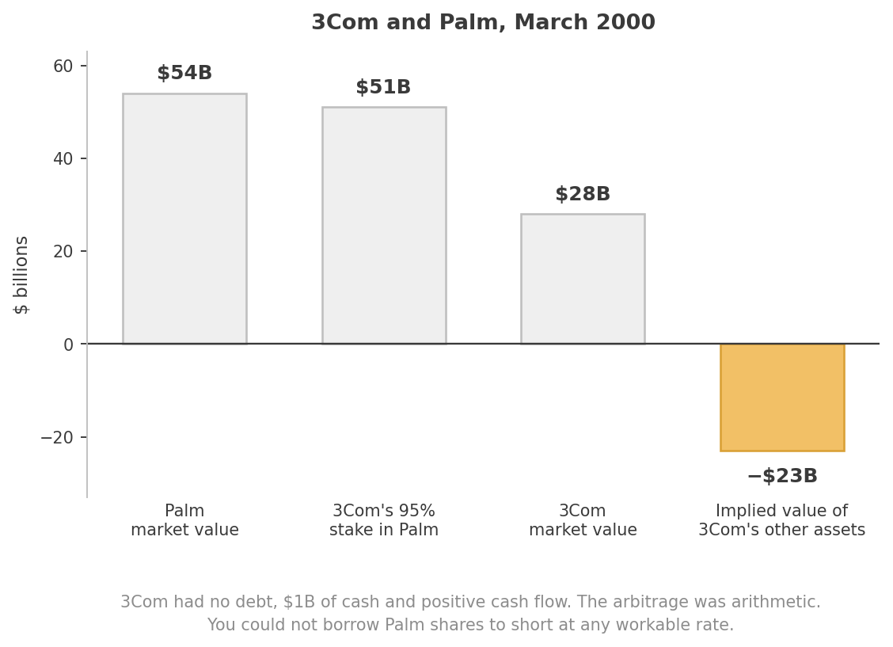
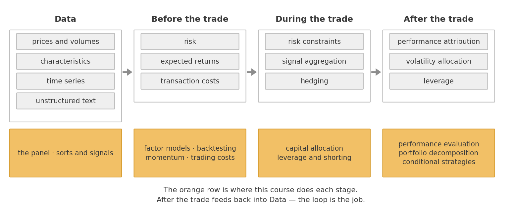

What is Data Driven Investing?
====================

*Read this on your own before we start. It is the map for the whole term: what
we are trading, who is on the other side, where the money comes from, and how
the pieces of the course fit together.*

**Three questions this chapter answers**

1. What is quantitative investing, at its core?
2. Who else is in the market, and why does that matter to you?
3. Where do excess returns actually come from?

Parts of the second and third sections draw on Chapter 1 of Giuseppe Paleologo's
*The Elements of Quantitative Investing*, which is the best short treatment of
this material I know and which is on the reading list for your final project.

---

## Part I — The core

Data Driven investing is about leveraging large and diverse datasets through
exploration, prediction, inference, and theory to reach better,
systematically-driven investment decisions. At its core it involves identifying
patterns in asset prices and exploiting those insights using robust statistical
methods and computational techniques.

Start with the narrow version — quantitative investing — and we will get to the
broader one at the end.

* This is a class about investing in practice.
* We will learn how to use data to guide investment decisions.
* Focus on how to organize, analyze, and investigate financial data sets.
* We will learn the state of the art in quantitative investing, and learn how to
  evaluate new quantitative strategies.
* Develop tools and programming skills that can be applied widely: asset
  management, investment banking, corporate finance, strategy.

### Between passive and active

Most traditional quantitative investing is associated with **factor investing**:
using data and theory to systematically construct portfolios, with a focus on
the statistical properties of asset returns — means, standard deviations,
covariances — and on using fundamental data in an algorithmic fashion. The
industry sometimes calls this *smart beta*.

Factor investing sits right between strictly passive strategies that just hold
the market and purely active strategies where managers pick assets based on
judgment.

What is distinctive about quantitative investing in its best form is that it
uses a lot of data, is back-tested against history, and maintains a fierce
interaction between capital allocation and research on signal quality. You do
not just find a pattern; you decide how much to bet on it, and you keep
re-deciding.

### Where it came from

In some ways the father of quantitative investing is **Jack Bogle**, who
operationalized the index fund in a way that was cheap and accessible. This
essentially built the conditions for showing that active managers were mostly
big losers relative to an easy, cheap index fund, and induced the shift from a
personality-centric culture to a data-centric one.

*Jack Bogle, founder of Vanguard, is the father of market-cap investing*

The evidence he made visible is still the single most quoted fact in this
industry:

Over fifteen years, roughly nine out of ten US large-cap active funds failed to
beat the index they were measured against. One year of outperformance turns out
not to predict the next. That is the benchmark any strategy in this course has
to clear, and it is a higher bar than it looks.

**Eugene Fama and Kenneth French** are the academic founders who in many ways
were well ahead of what the industry was doing at the time. They developed or
perfected most of the techniques used to construct and evaluate quant
strategies, and were instrumental in building clean and organized data
repositories for financial data — which is why you will be downloading data from
Ken French's website in week one.

*Gene Fama and Ken French*

---

## Part II — The territory

Knowing the techniques is not enough. You also need to know what you are allowed
to trade, who you are trading against, and why there is any money in it. This is
the part most courses skip.

### What you can trade

We are concerned with claims that are **standardized** and **liquid**.

Standardized means the attributes of the contract are clearly defined and known
to everyone: one Apple share is indistinguishable from another. Liquid means you
can buy and sell in the size you need, in the time you have, without a
transaction cost that eats the whole idea.

The main families are equities and ETFs, futures, bonds, vanilla options, and a
range of swaps. This course lives almost entirely in equities, but the framing
matters beyond them.

The two properties are connected. Standardization *creates* liquidity, because
it consolidates scattered demand for bespoke products onto a small number of
identical ones. Think about the counterexample. Selling a house means finding
one specific buyer, who spends weeks searching and then bargains hard, because
every house differs in location, size, age, layout and condition. There is no
"the house market" in the sense that there is a stock market.

Hold onto this. When we get to trading costs later in the term, the entire
question is what happens when you try to trade something in a size the market
was not expecting — which is a question about liquidity, which is a question
about how standardized and widely held the thing is.

### Who is on the other side

Every trade you make has a counterparty. It is worth knowing who they might be,
because your returns come out of that interaction.

The **sell side** facilitates trading. *Dealers* quote a bid and an ask and take
the other side of your trade, earning the spread; they provide liquidity and are
paid for it. *Brokers* do not take positions — they execute on your behalf, find
the venue, and handle settlement, custody, margin lending, and locating shares
when you want to short. *Broker-dealers* do both, which creates an obvious
conflict that a great deal of regulation exists to manage.

The **buy side** trades for its own benefit. This is where you will be, and it
is much more varied than the hedge-fund stereotype:

- **Indexers** — mutual funds and ETFs tracking a published benchmark. Blackrock,
  Vanguard, State Street. They are enormous.
- **Hedgers** — airlines buying fuel futures, manufacturers hedging currency.
  They are in the market to *reduce* risk from a business they run elsewhere.
- **Institutional active managers** — investing for clients against a benchmark,
  constrained by a tracking-error budget that limits how far they can stray.
- **Asset allocators** — managing across asset classes, with weights that move
  slowly.
- **Informed traders** — hedge funds and principal trading firms, pursuing
  absolute returns, investing heavily in people, technology and data.
- **Retail investors** — trading their own accounts. The evidence across many
  markets and periods is that they are, on average, unprofitable.

Two things in that figure. Indexing is now a very large share of the US stock
market — how large is genuinely contested, which is itself a useful lesson about
financial data. And retail trading roughly doubled as a share of volume over the
decade to 2020.

Now the point of the whole list. **Most of the money in the market is not trying
to beat you.** An indexer buys a stock because it entered the index, not because
it is cheap. An airline sells fuel futures because it wants a predictable cost
base, not because it has a view on oil. A retail order is, statistically,
uninformed — which is why dealers pay brokers for the right to receive it.

If your strategy makes money, someone is on the other side of it. It is worth
being able to say who, and why they were willing.

### Where do the excess returns come from?

"Excess" means in excess of what you would earn holding risk-free short-dated
Treasuries. So: why is there anything left over?

A market is **efficient** with respect to some set of information if prices
would not move were that information revealed to everyone. Note what that does
*not* say. It does not say prices are unpredictable. There is a great deal of
evidence that returns are predictable. The claim is that you cannot *profit*
from the prediction, and the interesting question is what stops you.

**Risk.** Suppose you are confident the market will return 8% next year against
2% in cash. Do you put everything into SPY? No — the standard deviation of the
market is about 20%. Being right on average and being comfortable are different
things.

**Liquidity.** In 2000, 3Com floated 5% of its subsidiary Palm on the public
market and kept the other 95%. Within days Palm was worth $54B while 3Com — the
owner of 95% of Palm — was worth $28B in total.

Work through it. If 3Com's stake in Palm was worth about $51B and all of 3Com
was worth $28B, the market was pricing everything else 3Com owned at roughly
*minus twenty-three billion dollars* — for a company with no debt, a billion in
cash, and positive cash flow. Buy 3Com, short Palm, wait for the arithmetic to
assert itself.

Almost nobody could do it. Palm shares were nearly impossible to borrow, and
where they could be borrowed the rate destroyed the trade. The prediction was
about as certain as predictions get in finance, and it was not tradable.

**Funding.** The moment an asset is cheapest is usually the moment you have just
lost money on it, your broker wants more margin, and you need to hold a buffer
against losing more tomorrow. Being right and staying solvent are separate
constraints, and the second one binds first.

**Predictable flows.** Index providers rebalance on announced dates using
published rules, and every fund tracking the index has to trade at the close of
that day whether or not the price is good. When Tesla was added to the NASDAQ
100, anyone who saw it coming could buy in advance and sell into that forced
demand. This is not free money — you hold the stock for days and carry the risk
— but the demand really is predictable, and the buyers of index products bear
the cost of it.

**Informational advantage.** Knowing something your competitors do not. This is
the one everybody assumes is the whole game. It is one of five.

These categories overlap, and telling risk compensation apart from a genuine
information advantage is often not possible. But when you find a signal that
works, the first question to ask is which of these it is. If you cannot answer,
the most likely explanation is a sixth one: it never worked, and you looked at
enough series to find something that appeared to. We spend two full meetings on
that possibility.

---

## Part III — How the pieces fit together

The investment process has a natural order, and this course follows it.

**Data.** Prices and volumes. *Characteristics* — numbers attached to a security
at a point in time, like a firm's cash flow divided by its market cap, or its
return over the past six months. *Time series* that describe the world rather
than one security: CPI, the ten-year yield, the VIX. And *unstructured* data —
earnings call transcripts, news, satellite images — which is where much of the
current effort is going.

**Before the trade.** Three things get built from that data: an estimate of
**risk**, an estimate of **expected returns**, and an estimate of **transaction
costs**. All three are estimates, all three are wrong, and how wrong turns out
to matter enormously.

**During the trade.** The three estimates get combined into actual positions.
This is where risk constraints bind, where many signals get aggregated into one,
and where you decide what to hedge.

**After the trade.** You have a P&L. Now attribute it: what worked, what did not,
and was the sizing any good? Then decide how much risk to run next period, and
at what leverage.

The loop closes — what you learn after the trade changes the data you use before
the next one. A strategy is not a formula, it is this cycle run repeatedly.

---

## Part IV — Broader than quantitative investing

Now the broader claim. **Data Driven investing is broader than
systematic/quantitative investing.** The tools developed here can be used even if
your fundamental source of insight is good old human judgment.

Sometimes the model *is* a set of human traders, and data helps you parse which
of them are good, and when. Evaluating a discretionary manager honestly, sizing
a position given what you believe, deciding whether last year's performance was
skill — these are the same techniques, pointed at a different object.

### The range of approaches

Styles differ mostly by horizon and by where the insight comes from:

- **Fundamental quantitative investing** — Blackrock, AQR, Bridgewater, DFA,
  Vanguard. Systematic application of economic and accounting insights that human
  analysts have long used, scaled computationally across a vast universe.
- **Factor models used to sharpen more traditional active strategies** — pod
  shops and similar, trading at horizons of months.
- **Statistical arbitrage** — exploiting statistical relationships between
  assets: pairs trading, ETF arbitrage, merger arbitrage, over days to weeks.
- **High frequency trading** — microsecond price discrepancies, won on computing
  and data infrastructure.

The boundary between classical statistical arbitrage and high-frequency trading
is not always clear. Toward the HFT end are Citadel Securities, Virtu Financial,
Susquehanna, Wolverine, and Jump Trading. Then Two Sigma, Jane Street, D.E.
Shaw, and Renaissance Technologies pursue a much broader set of signals. Pod
shops including Citadel, Millennium, Point72, Balyasny, ExodusPoint, and
WorldQuant run a variety of strategies, statistical arbitrage among them.

### The rise of pod shops

A particularly compelling evolution has been the rise of "pod shops" — Citadel,
Millennium, Point72. These multi-manager funds allocate capital to numerous
autonomous teams, each operating independently inside a strict centralized risk
framework. Pods focus on specialized strategies, often quantitative, and are
evaluated on their risk-adjusted returns.

The structure reallocates capital dynamically, scaling successful pods and
restricting underperforming ones. It is quantitative investing principles applied
to the business itself: systematic decision-making, disciplined risk management,
rigorous performance evaluation. It also reflects a shift toward combining many
modestly successful strategies rather than relying on a few large bets — which
is a mathematical statement, and we will prove it when we get to capital
allocation.

### What makes it hard

The systematic approach scales across assets and geographies, aggregates many
small edges into something worth having, and takes emotion out of decisions that
humans reliably get wrong. It also has characteristic failure modes, and you
should expect to meet all three:

- **Overfitting.** Search a large enough space and you will find a pattern in
  noise. It will backtest beautifully.
- **Regime shifts.** The relationship you estimated held in the sample you
  estimated it on.
- **Alpha decay.** Once a strategy is known, it is traded, and once it is traded
  the return goes away. Published anomalies are weaker after publication than
  before.

---

## The takeaways

1. **Quantitative investing sits between passive and active.** Rules-based,
   transparent, high capacity, low fee. Bogle made the case for the passive
   baseline; Fama and French built the tools for measuring anything above it.
2. **You can only trade what is standardized and liquid.** These two properties
   reinforce each other, and together they set the ceiling on any strategy's
   size.
3. **The market is not a room full of people trying to beat you.** Indexers,
   hedgers, and retail traders are all in it for reasons other than alpha, and
   that is frequently where your returns come from.
4. **Excess returns have five sources**: risk, liquidity, funding constraints,
   predictable flows, and informational advantage. Only the last is what most
   people mean by an edge. For any strategy, be able to name which one you think
   you have.
5. **The process has an order**: data, then risk and return and cost estimates,
   then portfolio construction, then attribution — and back to the start. This
   course walks that order.
6. **Data-driven investing is broader than quantitative investing.** These tools
   evaluate, size, and discipline any investment process, including one whose
   insight comes from human judgment.
